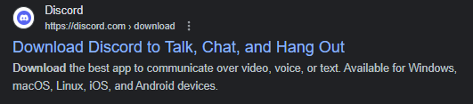
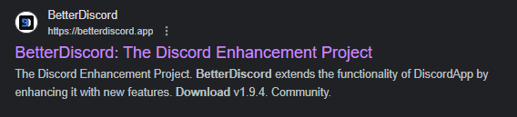

<h1 align='center'>Custom Made Discord Themes</h1>

[Darth Revan](#darth-revan) 
[The Green Arrow](#the-green-arrow) 
[Lord of the Rings: The Ring](#lord-of-the-rings-the-ring) 
[Lord of the Rings: The Fellowship](#lord-of-the-rings-the-fellowship) 
[Shoto Todoroki](#shoto-todoroki) 
[Star Wars: Darth Traya](#star-wars-darth-traya) 
[Star Wars: Darth Vader](#star-wars-darth-vader) 
[NF](#nf) 
[Dark Green](#dark-green)      

<h2 align='center'>How To Install</h2>

    *** Discord updates may require 'Better Discord' to be reinstalled periodically ***

    1a.) Download 'Discord' from Google

    1b.) Download 'Better Discord' from Google

    1c.) Download css file of desired theme
    
    1ca.) Download one of my files using link next to preview OR
    
    1cb.) Download from 'Better Discord' website from 'Themes' tab

    2.) Open normal discord

    3.) Select 'User Settings' on the bottom left corner of Discord

    4.) Scroll down to 'BETTERDISCORD' section on left tab and click on 'Themes'

    5.) Click on 'Open Themes Folder' at top of 'Themes' page

    6.) Move download css file from 'Downloads' folder on pc into the folder opened by Discord from 'Open Themes Folder' button

    Note: Additional themes by random people found on Better Discord website

<!-- custom theme previews -->
<h2 align='center'>Theme Previews</h2>

<h3 align='center'>Darth Revan</h3>

<a href='https://drive.google.com/file/d/1XQQRRr_b4uXelrVYlbiN3LAzGqJtcNlI/view?usp=sharing'>Download Darth Revan Theme</a>

    
    
:arrow_up: <a href="#custom-made-discord-themes">Back to top</a> :arrow_up:

<h3 align='center'>The Green Arrow</h3>

<a href='https://drive.google.com/file/d/1S19WEZWDF-SjPhIa1_5iB70zUNv2zU3M/view?usp=sharing'>Download The Green Arrow Theme</a>

    
    
:arrow_up: <a href="#custom-made-discord-themes">Back to top</a> :arrow_up:

<h3 align='center'>Lord of the Rings: The Ring</h3>
<!-- 
<a href='https://drive.google.com/file/d/1-Nq8rhVgST9qbZG4ALIF9loJ8bfO279d/view?usp=share_link'>Download Lord of the Rings: The Ring Theme</a>
 -->

    
    
:arrow_up: <a href="#custom-made-discord-themes">Back to top</a> :arrow_up:

<h3 align='center'>Lord of the Rings: The Fellowship</h3>
<!-- 
<a href='https://drive.google.com/file/d/1FkLHx6ThK8tlTGuKt2SSBVig4WYE-Vp1/view?usp=sharing'>Download Lord of the Rings: The Fellowship Theme</a>
 -->

    
    
:arrow_up: <a href="#custom-made-discord-themes">Back to top</a> :arrow_up:

<h3 align='center'>Shoto Todoroki</h3>
<!-- 
<a href='https://drive.google.com/file/d/19vYIQlxmHaHikmtNXvmBgbkSrsaJbz1-/view?usp=share_link'>Download Shoto Todoroki Theme</a>
 -->

    
    
:arrow_up: <a href="#custom-made-discord-themes">Back to top</a> :arrow_up:

<h3 align='center'>Star Wars: Darth Traya</h3>
<!-- 
<a href='https://drive.google.com/file/d/14UOtwY1Z6wGfHCXYJKwfEuNh5O0LG7jc/view?usp=share_link'>Download Star Wars: Darth Traya Theme</a>
 -->

    
    
:arrow_up: <a href="#custom-made-discord-themes">Back to top</a> :arrow_up:

<h3 align='center'>Star Wars: Darth Vader</h3>
<!-- 
<a href='https://drive.google.com/file/d/1t-iGTsPjjtlirdFLqI3YZasPd5JciI8Z/view?usp=sharing'>Download Star Wars: Darth Vader Theme</a>
 -->

    
    
:arrow_up: <a href="#custom-made-discord-themes">Back to top</a> :arrow_up:

<h3 align='center'>NF</h3>
<!-- 
<a href='https://drive.google.com/file/d/1E6cOCxl-6rIZfCSLMweZvPzdeYIBleP9/view?usp=share_link'>Download NF Theme</a>
 -->

    
    
:arrow_up: <a href="#custom-made-discord-themes">Back to top</a> :arrow_up:

<h3 align='center'>Dark Green</h3>
<!-- 
<a href='https://drive.google.com/file/d/1JM-sruVTm7nqaTh6ZSDjkGHVy21OCU7y/view?usp=share_link'>Download Dark Green Theme</a>
 -->

    
    
:arrow_up: <a href="#custom-made-discord-themes">Back to top</a> :arrow_up:

